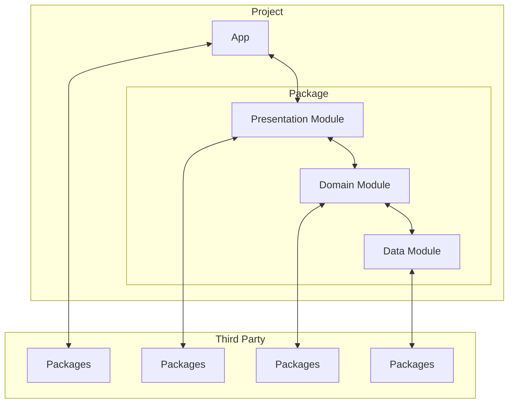

# c-search
This is an app to search corporate info

## Goal
Experiment with an **engaging approach** for iOS app development
- Swift Package Manager
- Swift Concurrency
- SwiftUI
- Combine

## Dependencies


## Setup
```sh
bundle install
echo 'NationalTaxAgencyApiKey=XXXXXXXXXXXXX' >>.env
bundle exec arkana -c .arkana.yml -e .env
```
